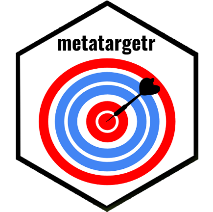

::: {.cell}

:::


### Methodology


In collaboration with [Who Targets Me](https://whotargets.me/), we monitored 4 political advertisers to better understand how campaigns use different targeting methods made available by Meta. To do this, we used data from the [Meta Ad Library](https://www.facebook.com/ads/library/), using the new 'Audience' data which gives some detail on how pages target their ads. 


To better understand the election, we kept only advertisers who:

1. Advertised in the last 7 days (29 nov - 5 dec 2023)
2. Advertised in the last 30 days (6 nov - 5 dec 2023)


::: {.callout-note}
Meta only provides 7, 30 and 90 days windows for the targeting data in their Ad Library. Meta's data also lags by a few days. Report will be updated as soon as new data is available.
:::


::: {.callout-caution}
## Disclaimer

The data shown in this dashboard is based on the platform's respective ad libraries which are known to be sometimes incomplete ([Edelson et al. 2020](https://ieeexplore.ieee.org/abstract/document/9152626?casa_token=X9SB7c8W9rAAAAAA:ymZr9ynFNTU6Fjzg3dcQpBzZpJ8bsEfj-H0RVTu2EZafKjhcD5Zu_VQ0aJc6qi9OMks3mUdFs-g); [Silva et al. 2020](https://dl.acm.org/doi/abs/10.1145/3366423.3380109?casa_token=ddoyvLl4R5YAAAAA:JqVLRLe6GHlR2o4zZqbEMlReyuTTyQxCGteUkdcFMR0xuCYWgwdl3NKyK05REOZm8vYl_W-bjOEaepM)). For this reason the data shown here might not reflect the full picture nor all political ads that were targeted at voters.

:::

### About the Creator of the Dashboard


::: {.cell}
::: {.cell-output .cell-output-stderr}
```
Warning: package 'htmltools' was built under R version 4.2.3
```
:::

::: {.cell-output-display}
```{=html}
<div class="card">
<div class="row no-gutters align-items-center">
<div class="col-md-2">
<div style="display: flex; justify-content: center;">

</div>
</div>
<div class="col-md-2">
<div class="card-body">
<p class="card-text">Fabio Votta is a Postdoc at the University of Amsterdam who studies (online) political microtargeting and its usage around the world.</p>
</div>
</div>
</div>
</div>
```
:::
:::


:::: {style="display: flex; justify-content: center; align-items: center;" }

::: {}

:::

::: {}
Want to see how political parties target *you*? [Sign up](https://whotargets.me/) at **Who Targets Me** and download the gratis browser plugin to see how parties on Facebook use your data:

[https://whotargets.me/](https://whotargets.me/)
:::

::::

:::: {style="display: flex; justify-content: center; align-items: center;" }

::: {}

:::

::: {}
Want to retrieve targeting data from the Facebook Ad Library yourself? This dashboard is powered by the R package: `metatargetr`. Check it out here:

[https://github.com/favstats/metatargetr](https://github.com/favstats/metatargetr)
:::

::::


### Election Targeting Dashboards

A list of election dashboards:

+ 🇳🇱 [2021 Dutch parliamentary election](https://favstats.github.io/DutchElectionObservatory/en/index.html) (15th-17th March 2021)
+ 🇩🇪 [2021 German federal election](https://favstats.shinyapps.io/btw21_wtm) (26 September 2021)
+ 🇸🇪 [2022 Swedish general election](https://favstats.github.io/SwedishElection2022/) (11th September 2022)
+ 🇺🇸 [2022 United States midterm elections](https://whotargetsme.shinyapps.io/midterms2022/) (8th November 2022)
+ 🇺🇸 [2022 United States midterm elections - Georgia Runoff](https://whotargetsme.github.io/midterms2022_dashboard/) (6th December 2022)
+ 🇮🇹 [2023 Lazio & Lombardy regional election](https://favstats.github.io/regionali2023/) (12-13th February 2023)
+ 🇪🇪 [2023 Estonian parliamentary election](https://favstats.github.io/EstoniaElection2023/) (5th March 2023)
+ 🇳🇱 [2023 Dutch provincial elections](https://favstats.github.io/ProvincialeStatenverkiezingen2023/) (15th March 2023)
+ 🇲🇪 [2023 Montenegrin presidential elections](https://favstats.github.io/MontenegroPresidentialElection2023/) (19th March 2023) - 1st round
+ 🇦🇺 [2023 New South Wales state election](https://favstats.github.io/NSWAustralianElection2023/) (25th March 2023)
+ 🇫🇮 [2023 Finnish parliamentary election](https://favstats.github.io/FinlandElections2023/) (2 April 2023)
+ 🇹🇷 [2023 Turkish general election](https://favstats.github.io/TurkishElection2023/round1) (14 May 2023) - Round 1
+ 🇩🇪 [2023 Bremen State election](https://favstats.github.io/BremenStateElection2023/) (14 May 2023)
+ 🇬🇷 [2023 Greek Legislative election](https://favstats.github.io/BremenStateElection2023/) (21 May 2023)
+ 🇹🇷 [2023 Turkish Presidential election](https://favstats.github.io/TurkishElection2023/) (14 May 2023) - Round 2
+ 🇲🇪 [2023 Montenegrin parliamentary elections](https://favstats.github.io/2023MontenegrinParliamentaryElection/) (11 June 2023)
+ 🇬🇷 [2nd 2023 Greek Legislative election](https://favstats.github.io/2ndGreeceElection2023/) (25 May 2023)
+ 🇸🇰 [2023 Slovak parliamentary election](https://favstats.github.io/slovakia2023/) (30 September 2023)
+ 🇩🇪 [2023 Bavarian state election](https://favstats.github.io/LTW2023/bavaria) (8 October 2023)
+ 🇩🇪 [2023 Hessian state election](https://favstats.github.io/LTW2023/hessen) (8 October 2023)
+ 🇳🇿 [2023 New Zealand general election](https://favstats.github.io/NZ2023/) (14 October 2023)
+ 🇵🇱 [2023 Polish parliamentary election](https://favstats.github.io/poland2023/) (15 October 2023)
+ 🇺🇸 [US Presidential Primaries](https://favstats.github.io/USprimaries2024/) (2023-2024)


